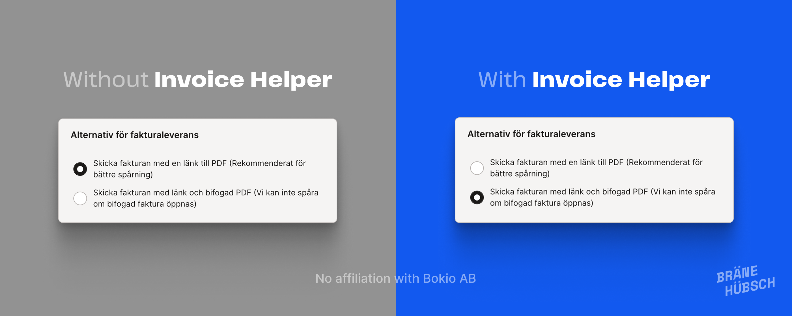
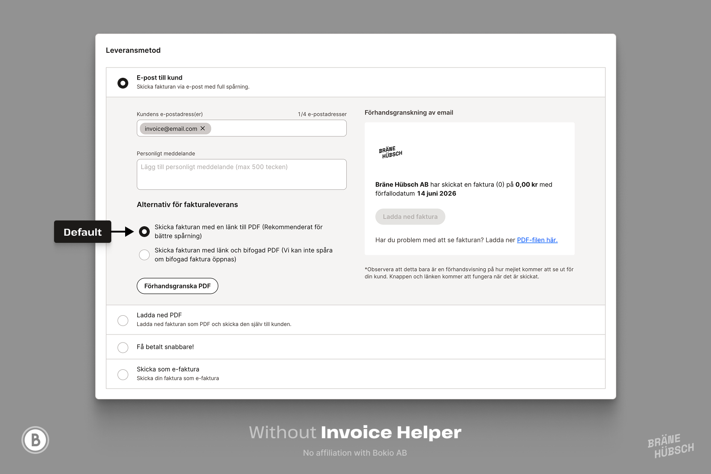
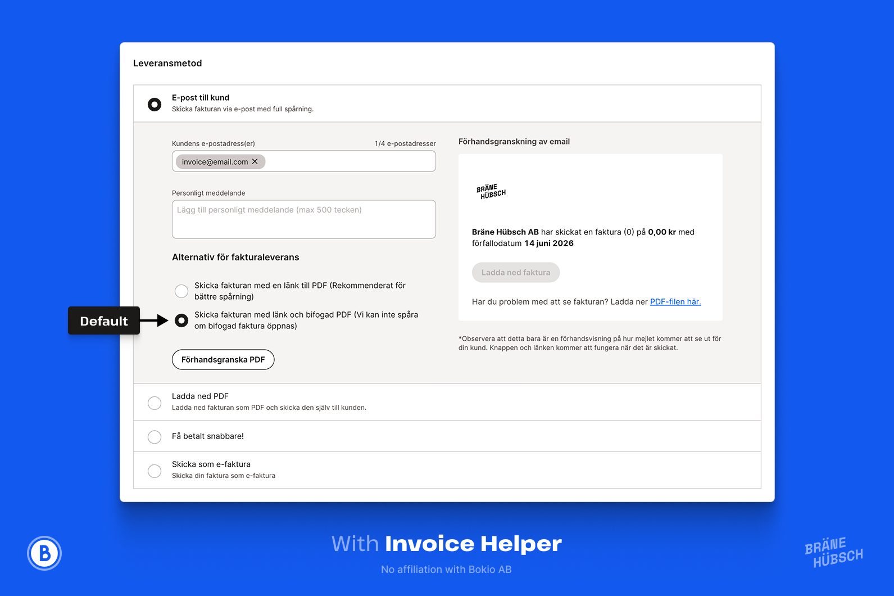

# Invoice Helper for Bokio

Ever sent an invoice from Bokio, only to discover a month later that it
was never paid because the delivery method was wrong? No more.

Invoice Helper for Bokio quietly sets **PDF & link** as the default invoice
method, so your invoices go out with the delivery option you actually meant
to choose. It works across all Bokio interface languages because it targets
the underlying delivery option instead of visible text.

This is a small WebExtension that runs only on Bokio invoice edit pages:

```text
https://app.bokio.se/*/invoicing/invoices/edit/*
```

When Bokio has already rendered the email delivery options, the extension selects the code-defined `LinkAndPdf` invoice delivery type. The toolbar popup also includes an optional setting to autoselect the outer "email to customer" delivery method.

## Screenshots

| Without Invoice Helper | With Invoice Helper |
| --- | --- |
|  |  |

Design file: [Invoice Helper for Bokio](https://www.figma.com/design/dQi1np2NSqPSsxy44hhLbt/Invoice-Helper-for-Bokio?node-id=0-1&t=Owb54m0x5j83OVD3-1)

## Install in Chrome or Opera

1. Open `chrome://extensions` or `opera://extensions`.
2. Enable developer mode.
3. Choose "Load unpacked".
4. Select this project folder.

## Firefox Notes

The runtime code avoids Chrome-specific extension APIs. A Firefox version should be able to reuse `src/content.js`; if Firefox needs store-specific manifest metadata, keep that as a separate manifest variant while sharing the same source and icons.

## Development

Install the dev dependencies:

```sh
npm install
```

Run the tests:

```sh
npm test
```

The tests use Playwright. If your local Playwright install does not already have a browser available and you do not have Chrome/Chromium/Edge installed, run:

```sh
npx playwright install chromium
```

Regenerate icons after updating `icons/source/store-icon.png`, `icons/source/icon.png`, or `icons/source/icon-inactive.png`:

```sh
npm run generate-icons
```

The selectors intentionally avoid visible text so Bokio can be used in Swedish or English.

## License

This project is licensed under the [GNU General Public License v3.0 only](LICENSE).

## Disclaimer

Bokio, including the Bokio name and logo, is owned by and trademarked by Bokio AB. This project is not affiliated with, endorsed by, or sponsored by Bokio AB.
